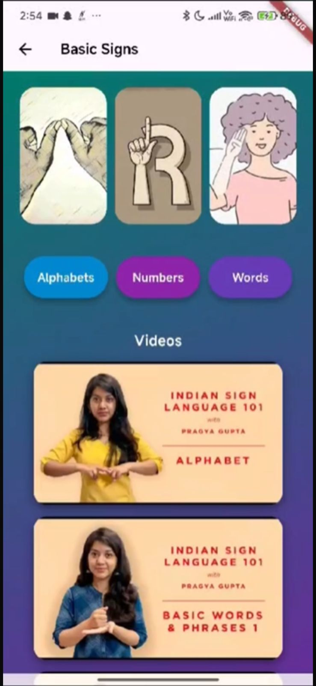
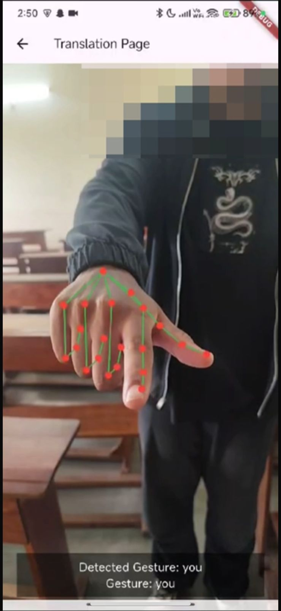

# Sign Language Translator

A real-time Sign Language Translator that uses hand-tracking and machine learning to recognize sign gestures and convert them into text or speech.

## Problem Statement

Communication between hearing-impaired individuals and non-signers can be challenging due to the lack of accessible real-time translation tools. This project aims to lay a basic foundation to bridge that gap by providing an automated sign language recognition system that translates gestures into readable or audible output.

## Features

- Real-time hand gesture recognition
- Converts sign language to text/speech
- Indian Sign Language support
- Feedback via Firebase

## Tech Stack

- Python
- TensorFlow
- MediaPipe
- Flutter
- Firebase (Firestore)
- OpenCV

## Screenshots

## Project Structure

- `/sign/` – Flutter front-end
- `/sign_backend/` – Python + TensorFlow model

## Author

- **Errol Caeiro**  
  [LinkedIn](https://linkedin.com/in/errolc11)

## Acknowledgements

I would like to express my gratitude to the following individuals who have contributed to the development of this project:

- Amron Costa
- Cain Crasto
